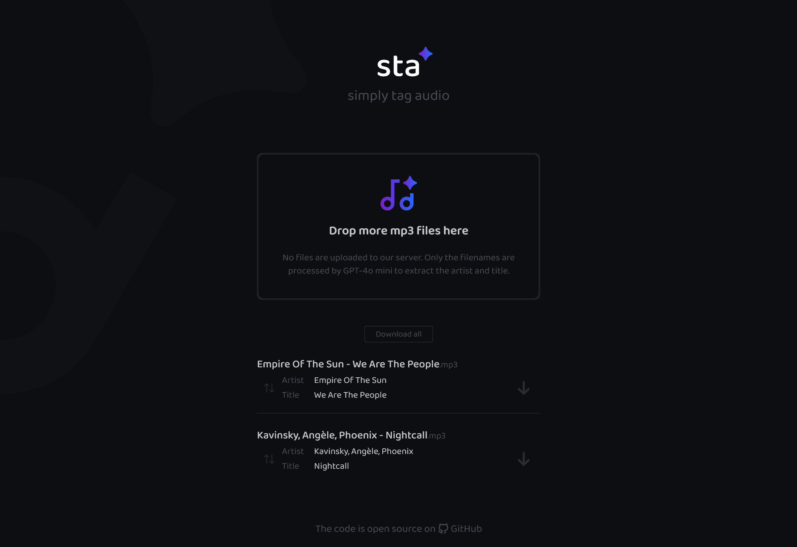

sta - simply tag audio
===============

A simple project to embed title and artist metadata into MP3 files - nothing fancy ♫

[](https://sta.pyxl.dev/)

The frontend is built with Angular, while the backend uses Hono. The backend’s sole purpose is to send a request with uploaded file names to GPT-4o mini to identify the artist and song title as accurately as possible.

All metadata modifications for the title and artist are done locally in the browser using [mp3tag.js](https://github.com/eidoriantan/mp3tag.js), ensuring that no files are ever sent to the server.
### Requirements

OpenAI API Key (needed for GPT-4o mini)

### Installation

```shell
git clone https://github.com/devfake/sta
```

### Backend

```shell
# Navigate to the backend directory
cd sta/backend
# Install dependencies
npm install
# Configure environment variables
cp .env.example .env
# Add your OpenAI API key to the .env file
OPENAI_API_KEY=YOUR_API_KEY
# Start the backend server
npm run dev
```

The backend will be available at `http://localhost:3000`.

### Frontend

```shell
# Navigate to the frontend directory
cd sta/frontend
# Install dependencies
npm install
# Start the Angular frontend
npm start
```

The frontend will be available at `http://localhost:4200`.

### Development

- Start both the Hono backend and the Angular frontend.
- The Angular frontend uses a proxy for backend calls:
  - Any API request to `/api` from the frontend is automatically forwarded to `http://localhost:3000/api`.

### Production

After running the `npm run build` script for the Angular frontend, the production files will be placed at `/backend/public`. The Hono backend is configured to serve these static files at `http://localhost:3000`.

### Rate Limiter

To protect the API from overuse, a rate limiter is enabled by default. This limits the number of API requests that can be made per hour.

You can adjust the limit by editing the `RATE_LIMIT_PER_HOUR` value in your `.env` file.


